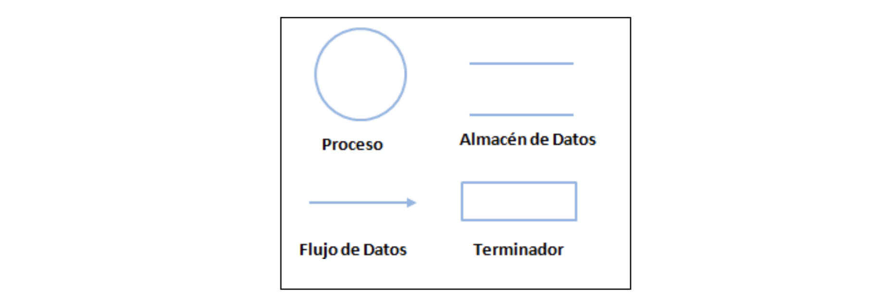
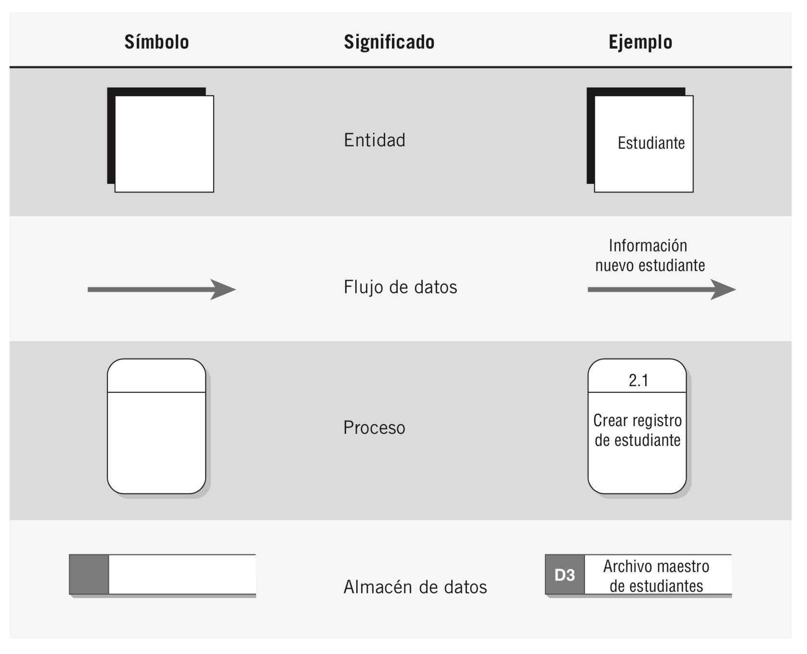
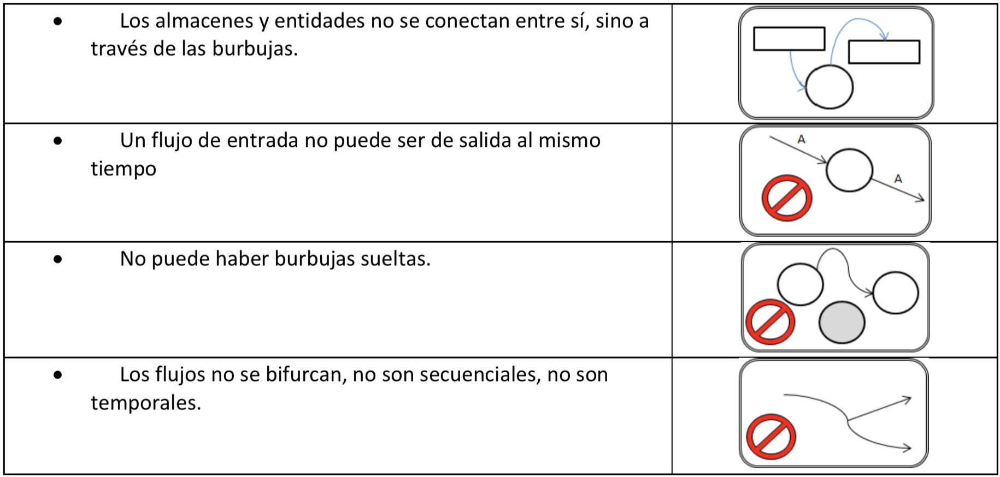
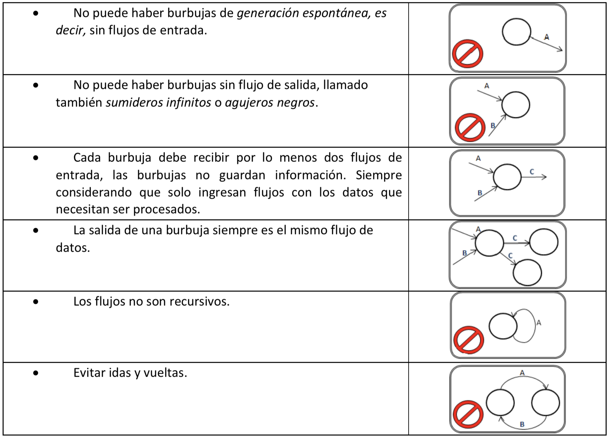
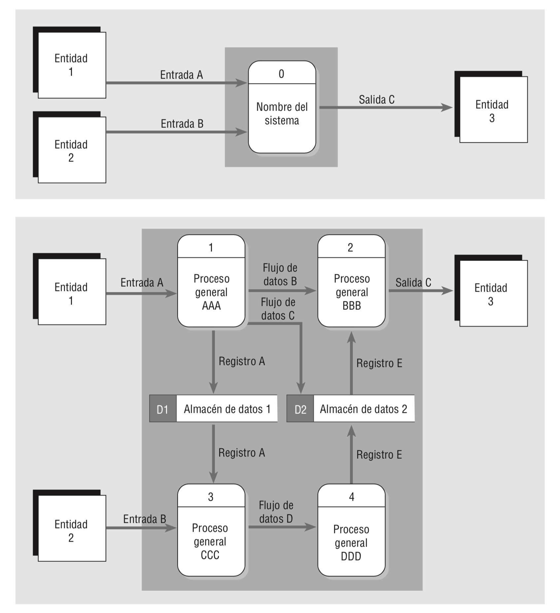
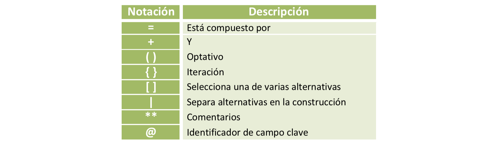
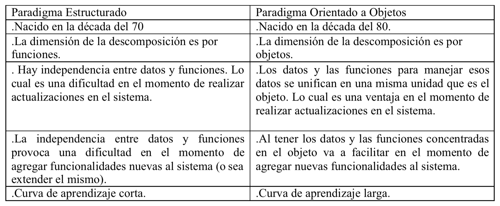
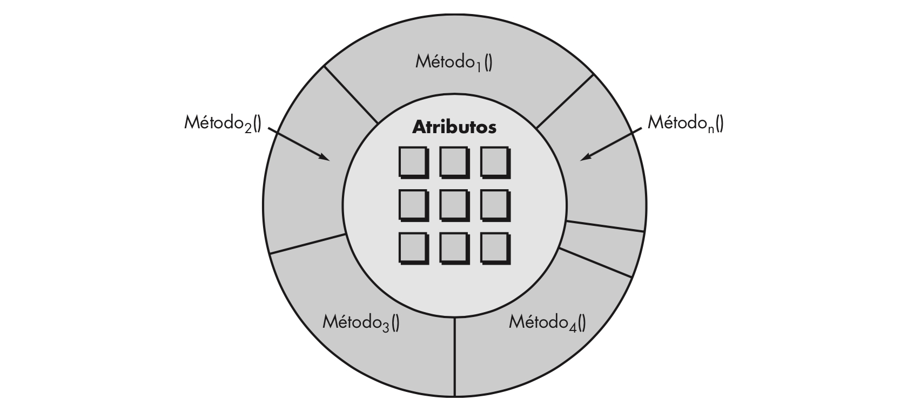
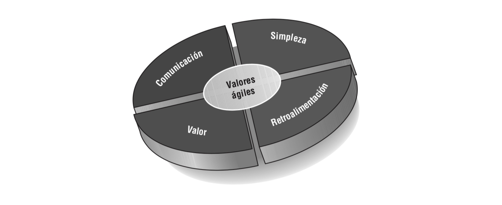

#Metodologías

##Metodología Estructurada

###Diagrama de Flujo de Datos (DFD)

Para que los analistas de sistemas puedan comprender los requerimientos de información de los usuarios, deben ser capaces de conceptualizar la forma en que los datos se mueven a través de la organización, los procesos o la transformación por la que pasan los datos y las salidas de los mismos. Aunque las entrevistas y la investigación de datos “duros” proveen una narrativa verbal del sistema, una descripción visual puede cristalizar esta información para los usuarios y analistas de una manera útil.
Por medio de una técnica de análisis estructurado conocida como diagramas de flujo de datos (DFD), el analista de sistemas puede ensamblar una representación gráfica de los procesos de datos a través de la organización. Al usar combinaciones de sólo cuatro símbolos, el analista puede crear una descripción ilustrada de los procesos con el fin de elaborar una documentación sólida para el sistema.

###Convenciones usadas en los diagramas de flujo de datos
Se utilizan cuatro símbolos básicos para graficar el movimiento de los datos en los diagramas: un cuadrado doble, una flecha, un rectángulo con esquinas redondas y un rectángulo con un extremo abierto (cerrado del lado izquierdo y abierto del lado derecho), como se muestra en la figura. Podemos describir en forma gráfica todo un sistema y numerosos subsistemas al combinar estos cuatro símbolos.  

* El **cuadrado doble** se utiliza para describir una entidad externa (otro departamento, una empresa, una persona o una máquina) que pueda enviar/recibir datos hacia/desde el sistema. La entidad externa, o simplemente entidad, también se conoce como origen o destino de los datos, y se considera externa al sistema que se está describiendo. Cada entidad se identifica con un nombre apropiado. Aunque interactúa con el sistema, se considera fuera de los límites de éste. Se debe denominar a las entidades con un sustantivo. Se puede utilizar la misma entidad más de una vez en un diagrama de flujo de datos para evitar cruzar las líneas de flujo de datos.

* La **flecha** muestra el movimiento de los datos de un punto a otro; la cabeza de la flecha apunta hacia el destino de los datos. Los flujos de datos que ocurren al mismo tiempo se pueden describir mediante el uso de flechas paralelas. Como una flecha representa datos sobre una persona, lugar o cosa, también se debe describir con un sustantivo.  

* Se utiliza un **rectángulo con esquinas redondas** para mostrar la ocurrencia de un proceso de transformación. Los procesos siempre expresan un cambio o transformación en los datos; por ende, el flujo de datos que sale de un proceso siempre se identifica de manera distinta al flujo que entra al proceso. Los procesos representan el trabajo que se realiza en el sistema y se deben denominar mediante el uso de uno de los siguientes formatos. Un nombre claro facilita la acción de entender lo que el proceso lleva a cabo.

* Se utiliza un **rectángulo con un extremo abierto** para representa a un almacén de datos. El rectángulo se dibuja con dos líneas paralelas que se cierran mediante una línea corta del lado izquierdo y cuyo extremo derecho está abierto. Estos símbolos se dibujan con la anchura suficiente como para permitir una leyenda de identificación entre las líneas paralelas. En los diagramas de flujo de datos lógicos no se especifica el tipo de almacenamiento físico. En este punto, el símbolo del almacén de datos muestra sólo un depósito de datos que permite examinar, agregar y recuperar los datos.  
El almacén de datos puede representar un almacén manual como un archivero, o un archivo o una base de datos computarizada. Como los almacenes de datos representan a una persona, lugar o cosa, se denominan con un sustantivo. Los almacenes de datos temporales, como el papel de borrador o un archivo temporal de computa- dora, no se incluyen en el diagrama de flujo de datos.

#####Símbolos alternativos:

Reglas básicas a seguir:

1. El diagrama de flujo de datos debe tener por lo menos un proceso y no debe haber objetos independientes o conectados a sí mismos.

2. Un proceso debe recibir por lo menos un flujo de datos entrante y debe crear por lo menos un flujo de datos saliente.

3. Un almacén de datos debe estar conectado con por lo menos un proceso.

4. Las entidades externas no se deben conectar entre sí. Aunque se comunican en forma independiente, esa comunicación no forma parte del sistema que diseñamos mediante el uso de DFD.

El Diagrama de Flujo de Datos proporciona una visión global de los componentes funcionales del sistema, pero no da detalles de estos, no indica qué información se transforma y cómo, para ello, adicionalmente, se utilizan dos herramientas textuales de modelado: el Diccionario de Datos y la Especificación de Procesos, sin estas herramientas el DFD no tiene valor alguno.

####Consideraciones para la construcción de DFD:

1. Comenzar por el Diagrama de Contexto, realizar sucesivos refinamientos hasta alcanzar el Diagrama de Detalle.

2. Elegir nombres significativos para cada componente del diagrama.

3. Numerar los procesos.

4. Limitar la cantidad de procesos para que sea comprensible, respetar la regla de no exceder 7 +/- 2.

5. Asegurar que el DFD sea internamente consistente.

Cada proceso en el Diagrama 0 puede a su vez expandirse para crear un diagrama hijo más detallado. Al proceso que se expande en el Diagrama 0 se le conoce como el proceso padre, y al diagrama que resulta se le conoce como el diagrama hijo. La regla principal para crear diagramas hijos es el balanceo vertical; esta regla establece que un diagrama hijo no puede producir salida o recibir entrada que el proceso padre no produzca o reciba también. Todos los datos entrantes o salientes del proceso padre deben mostrarse como entrantes o salientes en el diagrama hijo.

##Diccionario de datos

El diccionario de datos es una versión especializada de los diccionarios que se utilizan como referencias en la vida cotidiana. El diccionario de datos es una obra de consulta de información sobre los datos (es decir, metadatos); es compilado por los analistas de sistemas para guiarse a través del análisis y diseño. Como documento, el diccionario de datos recopila y coordina términos de datos específicos, además de confirmar lo que significa cada término para distintas personas en la organización.

El diccionario de datos define los datos haciendo lo siguiente:

* Describe el significado de los flujos y almacenes que se muestran en los DFD.

* Describe la composición de agregados de paquetes de datos que se mueven a lo largo de los flujos, es decir, paquetes complejos (por ejemplo, el domicilio de un cliente), que pueden descomponerse en unidades más elementales (como ciudad, estado y codigo postal).

* Describen la composición de los paquetes de datos en los almacenes.

* Especifica los valores y unidades relevantes de piezas elementales de información en los flujos de datos y en los almacenes de datos.

* Describen los detalles de las relaciones entre almacenes que se enfatizan en un diagrama de entidad-relacion.

El Diccionario de Datos utiliza la siguiente notación:

Ejemplo sobre la manera de utilizar la notación indicada para detallar en forma precisa el dato "Nombre del Cliente":  
Nombre del cliente = Titulo + Nombre + Apellido  
Título = [Sr. | Srta. | Sra. | Dr. | Prof.]  
Nombre = {Caracter válido}  
Apellido = {Caracter válido}  
Caracter válido = [A-Z|a-z|'|-| |]  

>Construir un "diccionario de datos es una de las tareas más tediosas y largas de un analista de sistemas, pero es una de las más importantes, sin un diccionario formal que describa el significado de los términos es imposible esperar precisión"

##Especificaciónes de Proceso (EP)
La Especificación del Proceso es la descripción de qué es lo que sucede en cada burbuja primitiva en el nivel más bajo en un DFD, es decir, en el diagrama de detalle. Su propósito es definir lo que se debe hacer para transformar las entradas en salidas. Se construye a partir del Diagrama de Flujo de Datos y del Diccionario de Datos.

La forma más utilizada para realizar las especificaciones de procesos es el lenguaje estructurado, pero se puede utilizar cualquier método que satisfaga dos requerimientos cruciales:

1. La especificación del proceso debe expresarse de una manera que pueda ser verificada tanto por el usuario como por el analista, evitando ambigüedades.

2. El proceso debe especificarse en una forma que pueda ser entendido claramente por los involucrados, usuarios, administradores, auditores, personal de control de calidad y otros, que leerán dicha especificación.

###Lenguaje estructurado
El lenguaje estructurado es un lenguaje habitual pero acotado en palabras y construcciones, a diferencia del lenguaje natural humano, genera más precisión y claridad, lo cual permite evitar ambigüedades.

##Diagrama Entidad-Relación (DER)
Se trata de una notación gráfica para modelar datos, “es un modelo de red que describe con alto nivel de abstracción la distribución de datos almacenados en un sistema” (Yourdon, 1993), se modela principalmente porque las estructuras de datos y sus relaciones pueden resultar tan complejas que se deben analizar en forma independiente del proceso que se llevará a cabo.

Un DER se conforma por los siguientes componentes:

* **Tipo de Objeto:** representa una colección o conjunto de objetos del mundo real, cuyas instancias o miembros individuales cumplen las siguientes características:
	
	- Se identifican unívocamente

	- Cada uno juega un papel necesario en el sistema que se construye
	
	- Cada uno puede describirse por uno o más datos

* **Relaciones:** Representa un conjunto de conexiones entre objetos, se representan mediante un rombo.

Cada instancia de la relación representa una asociación entre cero o mas ocurrencias de un objeto y cero o mas ocurrencias del otro. Puede existir más de una relación entre dos objetos.

* **Indicadores asociativos de tipo de objeto:** Representa algo que funciona como objeto y relación. Otra manera de verlo es considerar que el tipo asociativo de objeto representa una relación de la cual se desea mantener alguna información.

* **Indicadores de subtipo/supertipo:** Consisten en tipos de objetos de una o más subcategorías, conectados por una relación. Los subtipos se conectan al supertipo por medio de una relación sin nombre. El supertipo se conecta a la relación por una línea que tiene una barra.

##Metodología orientada a objetos

###Análisis Orientado a Objetos (AOO)

####Objetos
Los objetos son personas, lugares o cosas relevantes para el sistema a analizar. Los sistemas orientados a objetos describen las entidades como objetos. Algunos objetos comunes son clientes, artículos, pedidos, etcétera. Los objetos también pueden ser pantallas de GUI o áreas de texto en la pantalla.

Analizando lo anteriormente descripto se pueden observar las ventajas del Paradigma Orientado a objetos. Que son las siguientes:

* Menor dificultad en el momento de identificar objetos dado un sistema.

* Menor dificultad en el momento de realizar actualizaciones.

* Menor dificultad en el momento de extender el sistema. 

* Posibilidad de reutilización.

####Clase
Una clase es un concepto orientado a objetos que encapsula los datos y abstracciones procedurales requeridos para describir el contenido y el comportamiento de alguna entidad del mundo real. Las abstracciones de datos que describen la clase se encierran mediante una “pared” de abstracciones procedurales que son capaces de manipular los datos de alguna forma. En una clase bien diseñada, la única forma de llegar a los atributos (y operar sobre ellas) es ir a través de uno de los métodos que forman la “pared” que se ilustra en la figura.

Dicho de otra forma, una clase es una descripción generalizada (por ejemplo, una plantilla o plano) de una colección de objetos similares. Por definición, los objetos son instancias de una clase específica y heredan sus atributos y las operaciones que están disponibles para manipular esos atributos. Una superclase (con frecuencia llamada clase base) es una generalización de un conjunto de clases que se relacionan con ella. Una subclase es una especialización de la super- clase. Por ejemplo, la superclase VehículoDeMotor es una generalización de las clases Cammión, SUV, Automóvil y Van. La subclase Automóvil hereda todos los atributos de VehículoDeMotor, pero además incorpora atributos adicionales que son específicos solamente de automóviles.  
Estas definiciones implican la existencia de una jerarquía de clase en la que los atributos y operaciones de la superclase se heredan por parte de la subclase, que puede agregar atributos y métodos “privados” adicionales. 

###Herencia
Otro concepto clave de los sistemas orientados a objetos es la herencia. Las clases pueden tener hijos; es decir, se puede crear una clase a partir de otra. En UML, la clase original (o padre) se conoce como clase base; a la clase hija se le denomina clase derivada. Podemos crear una clase derivada de tal forma que herede todos los atributos y comportamientos de la clase base. Sin embargo, una clase derivada puede tener atributos y comportamientos adicionales. Por ejemplo, podría haber una clase Vehículo para una empresa de renta de automóviles que con- tenga atributos tales como tamaño, color y marca.  
La herencia reduce la labor de programación al permitir que se utilicen los objetos comunes con facilidad. El programador sólo necesita declarar que la clase Auto hereda de la clase Vehículo y después proporcionar todos los detalles adicionales sobre los nuevos atributos o comportamientos que sean únicos para un automóvil. Todos los atributos y comportamientos de la clase Vehículo pasan de manera automática e implícita a formar parte de la clase Auto y no requieren de programación adicional. Esto permite al analista definir una vez pero usar muchas veces; algo similar a los datos que están en la tercera forma normal, que se definen sólo una vez en una tabla de la base de datos

>Como todo concepto de diseño fundamental, la herencia puede proporcionar beneficios significativos para el diseño, pero si se usa de manera inadecuada, puede complicar un diseño de manera innecesaria y conducir a software proclive a errores, que es difícil de mantener. Por ejemplo, diseñar una subclase que herede atributos y operaciones de más de una superclase (en ocasiones llamada “herencia múltiple”) es mal vista por la mayoría de los diseñadores.

**Ventajas de la herencia:**

* Reutilización de código ya testeado.

* Se pueden agregar subclases sin que se altere el sistema siempre y cuando tengan el mismo comportamiento que la superclase y agregue su comportamiento propio. 

* Se pueden eliminar subclases sin que se altere el sistema

**Desventaja de la herencia:**

* Genera alto acoplamiento entre clases

###Agregación
Una agregación es un tipo especial de asociación que se indica mediante un diamante hueco en un extremo del ícono. Ello indica una relación “entero/parte”, en la que la clase a la que apunta la flecha se considera como una “parte” de la clase en el extremo diamante de la asociación.

Una clase puede tener atributos que sean de tipo numérico, string un objeto de otra clase.
En la Agregación se tiene una clase que está formada por atributos que son objetos de otra clase.
Por ejemplo: Si tenemos la Clase Avión (el todo) puede tener como atributo un objeto de la Clase Rueda y otro de la Clase Motor (llamadas las partes).

###Composición
Una composición es una agregación que indica fuerte propiedad de las partes. En una composición, las partes viven y mueren con el propietario porque no tienen papel en el sistema de software independiente del propietario.

Es una relación parecida a la relación de agregación, su diferencia estriba en si deja de existir el "todo" las partes también dejan de existir. Por ejemplo: si tenemos la cl ase Factura (seria el todo) y la clase línea de factura (serian las partes). En este caso si la clase Factura dejara de existir, la clase línea de factura deja de existir.

Arlow y Neustadt [Arl02] sugieren que cada clase de diseño se revise para garantizar que está “bien formada”. Definen cuatro características de una clase de diseño bien formada:

**Completa y suficiente:** Una clase de diseño debe ser el encapsulamiento completo de todos los atributos y métodos que razonablemente pueda esperarse que existan para la clase (con base en una interpretación enterada del nombre de la clase). Por ejemplo, la clase Escena definida para software de edición de video es completa sólo si contiene todos los atributos y métodos que razonablemente puedan asociarse con la creación de una escena de video. La suficiencia garantiza que la clase de diseño contiene solamente aquellos métodos que son suficientes para lograr la intención de la clase, ni más y ni menos.

**Primitividad:** Los métodos asociados con una clase de diseño deben enfocarse en lograr una función específica para la clase. Una vez implementada la función con un método, la clase no debe proporcionar otra vía para lograr lo mismo. Por ejemplo, la clase VideoClip del software de edición puede tener atributos punto-inicial y punto-final para indicar los puntos de inicio y finalización del clip (observe que el video en bruto cargado en el sistema puede ser más largo que el clip que se usa). Los métodos, _setStartPoint()_ y _setEndPoint()_ proporcionan el único medio para establecer puntos de inicio y finalización para el clip.

**Alta cohesión:** Una clase de diseño cohesiva tiene un solo propósito: tiene un pequeño conjunto enfocado en responsabilidades y aplica atributos y métodos decisivos para implementar dichas responsabilidades. Por ejemplo, la clase VideoClip del software de edición de video puede contener un conjunto de métodos para editar el clip de video. En tanto cada método se enfoque exclusivamente en atributos asociados con el videoclip, la cohesión se mantiene.

**Low coupling:** Dentro del modelo de diseño es necesario que las clases de diseño colaboren unas con otras. No obstante, la colaboración debe mantenerse en un mínimo aceptable. Si un modelo de diseño está enormemente acoplado (todas las clases de diseño colaboran con todas las otras clases de diseño), el sistema es difícil de implementar, probar y mantener con el tiempo. En general, las clases de diseño dentro de un subsistema deben tener solamente conocimiento limitado de otras clases. Esta restricción, llamada ley de Démeter [Lie03], sugiere que un método sólo debe enviar mensajes a métodos en clases vecinas.

##Metodologías Agiles

**¿Qué es?** La ingeniería de software ágil combina una filosofía con un conjunto de lineamientos de desarrollo. La filosofía pone el énfasis en: la satisfacción del cliente y en la razonable a la ingeniería de software convencional para ciertas clases de software y en algunos tipos de proyectos. Asimismo, se ha demostrado que concluye con rapidez sistemas exitosos.  
**¿Cuáles son los pasos?** Un nombre más apropiado para el desarrollo ágil sería “ingeniería de software ligero”. Permanecen las actividades estructurales fundamentales: comunicación, planeación, modelado, construcción y despliegue. Pero se transforman en un conjunto mínimo de tareas que lleva al equipo del proyecto hacia la construcción y entrega (algunas personas dirían que esto se hace a costa del análisis del problema y del diseño de la solución).  
**¿Cuál es el producto final?** Tanto el cliente como el ingeniero de software tienen la misma perspectiva: el único producto del trabajo realmente importante es un “incremento de software” operativo que se entrega al cliente exactamente en la fecha acordada.  
**¿Cómo me aseguro de que lo hice bien?** El trabajo estará bien hecho si el equipo ágil concuerda en que el proceso funciona y en que produce incrementos de software utilizables que satisfagan al cliente.  
entrega rápida de software incremental, los equipos pequeños y muy motivados para efectuar el proyecto, los métodos informales, los productos del trabajo con mínima ingeniería de software y la sencillez general en el desarrollo. Los lineamientos de desarrollo enfatizan la entrega sobre el análisis y el diseño (aunque estas actividades no se desalientan) y la comunicación activa y continua entre desarrolladores y clientes.  
**¿Quién lo hace?** Los ingenieros de software y otros parti- cipantes en el proyecto (gerentes, clientes, usuarios finales, etc.) trabajan juntos en un proyecto ágil, formando un equipo con organización propia y que controla su propio destino. Un equipo ágil facilita la comunicación y colabo- ración entre aquellos a quienes sirve.
**¿Por qué es importante?** El ambiente moderno de negocios que genera sistemas basados en computadora y pro- ductos de software evoluciona rápida y constantemente. La ingeniería de software ágil representa una alternativa

###Valores y principios del modelado ágil
Hay cuatro valores que crean un entorno en el que tanto los desarrolladores como las empresas pueden obtener el mismo servicio. Como a menudo hay tensión entre lo que hacen los desarrolladores a corto plazo y lo comercialmente deseable a largo plazo, es importante propugnar en forma deliberada los valores que formarán la base para actuar en conjunto en un proyecto de software. Los cuatro valores son comunicación, simpleza, retroalimentación y valor.

**Comunicación:** Las prácticas ágiles comunes como la programación en pareja, la estimación de tareas y la prueba de unidades dependen mucho de la buena comunicación. Los problemas se corrigen con rapidez, los orificios se tapan y el pensamiento débil se fortalece rápidamente por medio de la interacción con otros miembros del equipo.

###Principios de las metodologís agiles

1. La prioridad más alta es satisfacer al cliente a través de la entrega pronta y continua de software valioso.

2. Son bienvenidos los requerimientos cambiantes, aun en una etapa avanzada del desarrollo. Los procesos ágiles dominan el cambio para provecho de la ventaja competitiva del cliente.

3. Entregar con frecuencia software que funcione, de dos semanas a un par de meses, de preferencia lo más pronto que se pueda.

4. Las personas de negocios y los desarrolladores deben trabajar juntos, a diario y durante todo el proyecto.

5. Hay que desarrollar los proyectos con individuos motivados. Debe darse a éstos el ambiente y el apoyo que necesiten, y confiar en que harán el trabajo.

6. El método más eficiente y eficaz para transmitir información a los integrantes de un equipo de desarrollo, y entre éstos, es la conversación cara a cara.

7. La medida principal de avance es el software que funciona.

8. Los procesos ágiles promueven el desarrollo sostenible. Los patrocinadores, desarrolladores y usuarios deben poder mantener un ritmo constante en forma indefinida.

9. La atención continua a la excelencia técnica y el buen diseño mejora la agilidad.

10. Es esencial la simplicidad: el arte de maximizar la cantidad de trabajo no realizado.

11. Las mejores arquitecturas, requerimientos y diseños surgen de los equipos con organización propia.

12. El equipo reflexiona a intervalos regulares sobre cómo ser más eficaz, para después afi- nar y ajustar su comportamiento en consecuencia.

##Programación Extrema (XP)
La programación extrema usa un enfoque orientado a objetos como paradigma preferido de desarrollo, y engloba un conjunto de reglas y prácticas que ocurren en el contexto de cuatro actividades estructurales: planeación, diseño, codificación y pruebas.

###Valores XP
Beck define un conjunto de cinco valores que establecen el fundamento para todo trabajo realizado como parte de XP: comunicación, simplicidad, retroalimentación, valentía y respeto. Cada uno de estos valores se usa como un motor para actividades, acciones y tareas específicas de XP.

###Ciclo de vida
####Planeación
La actividad de planeación (también llamada juego de planeación) comienza escuchando —actividad para recabar requerimientos que permite que los miembros técnicos del equipo XP entiendan el contexto del negocio para el software y adquieran la sensibilidad de la salida y características principales y funcionalidad que se requieren—. Escuchar lleva a la creación de algunas “historias” (también llamadas historias del usuario) que describen la salida necesaria, características y funcionalidad del software que se va a elaborar. Cada historia (similar a los casos de uso descritos en el capítulo 5) es escrita por el cliente y colocada en una tarjeta indizada. El cliente asigna un valor (es decir, una prioridad) a la historia con base en el valor general de la característica o función para el negocio.
Después, los miembros del equipo XP evalúan cada historia y le asignan un costo, medido en semanas de desarrollo. Si se estima que la historia requiere más de tres semanas de desarrollo, se pide al cliente que la descomponga en historias más chicas y de nuevo se asigna un valor y costo. Es importante observar que en cualquier momento es posible escribir nuevas historias.  
Los clientes y desarrolladores trabajan juntos para decidir cómo agrupar las historias en la siguiente entrega (el siguiente incremento de software) que desarrollará el equipo XP. Una vez que se llega a un compromiso sobre la entrega (acuerdo sobre las historias por incluir, la fecha de entrega y otros aspectos del proyecto), el equipo XP ordena las historias que serán desarrolladas en una de tres formas:  

1. Todas las historias se implementarán de inmediato (en pocas semanas)

2. Las historias con más valor entrarán a la programación de actividades y se implementarán en primer lugar

3. las historias más riesgosas formarán parte de la programación de actividades y se implementarán primero.  

Después de la primera entrega del proyecto (también llamada incremento de software), el equipo XP calcula la velocidad de éste. En pocas palabras, la velocidad del proyecto es el número de historias de los clientes implementadas durante la primera entrega. La velocidad del proyecto se usa para: 1) ayudar a estimar las fechas de entrega y programar las actividades para las en- tregas posteriores, y 2) determinar si se ha hecho un gran compromiso para todas las historias durante todo el desarrollo del proyecto. Si esto ocurre, se modifica el contenido de las entregas o se cambian las fechas de entrega final.  
A medida que avanza el trabajo, el cliente puede agregar historias, cambiar el valor de una ya existente, descomponerlas o eliminarlas. Entonces, el equipo XP reconsidera todas las entre- gas faltantes y modifica sus planes en consecuencia.

###Diseño
El diseño XP sigue rigurosamente el principio MS (mantenlo sencillo). Un diseño sencillo siempre se prefiere sobre una representación más compleja. Además, el diseño guía la implementación de una historia conforme se escribe: nada más y nada menos. Se desalienta el diseño de funcionalidad adicional porque el desarrollador supone que se requerirá después.  
Si en el diseño de una historia se encuentra un problema de diseño difícil, XP recomienda la creación inmediata de un prototipo operativo de esa porción del diseño. Entonces, se implementa y evalúa el prototipo del diseño, llamado solución en punta. El objetivo es disminuir el riesgo cuando comience la implementación verdadera y validar las estimaciones originales para la historia que contiene el problema de diseño.  
Un concepto central en XP es que el diseño ocurre tanto antes como después de que comienza la codificación. Rediseñar significa que el diseño se hace de manera continua conforme se construye el sistema. En realidad, la actividad de construcción en sí misma dará al equipo XP una guía para mejorar el diseño.

###Codificación
Después de que las historias han sido desarrolladas y de que se ha hecho el trabajo de diseño preliminar, el equipo no inicia la codificación, sino que desarrolla una serie de pruebas unitarias a cada una de las historias que se van a incluir en la entrega en curso (incremento de software).  

###Pruebas
Ya se dijo que la creación de pruebas unitarias antes de que comience la codificación es un elemento clave del enfoque de XP. Las pruebas unitarias que se crean deben implementarse con el uso de una estructura que permita automatizarlas (de modo que puedan ejecutarse en repetidas veces y con facilidad). Esto estimula una estrategia de pruebas de regresión siempre que se modifique el código (lo que ocurre con frecuencia, dada la filosofía del rediseño en XP).  
A medida que se organizan las pruebas unitarias individuales en un “grupo de prueba universal” [Wel99], las pruebas de la integración y validación del sistema pueden efectuarse a diario. Esto da al equipo XP una indicación continua del avance y también lanza señales de alerta si las cosas marchan mal.  
Las pruebas de aceptación XP, también llamadas pruebas del cliente, son especificadas por el cliente y se centran en las características y funcionalidad generales del sistema que son visibles y revisables por parte del cliente. Las pruebas de aceptación se derivan de las historias de los usuarios que se han implementado como parte de la liberación del software.

###Valores XP
Beck [Bec04a] define un conjunto de cinco valores que establecen el fundamento para todo tra- bajo realizado como parte de XP: comunicación, simplicidad, retroalimentación, valentía y respeto. Cada uno de estos valores se usa como un motor para actividades, acciones y tareas específicas de XP.

